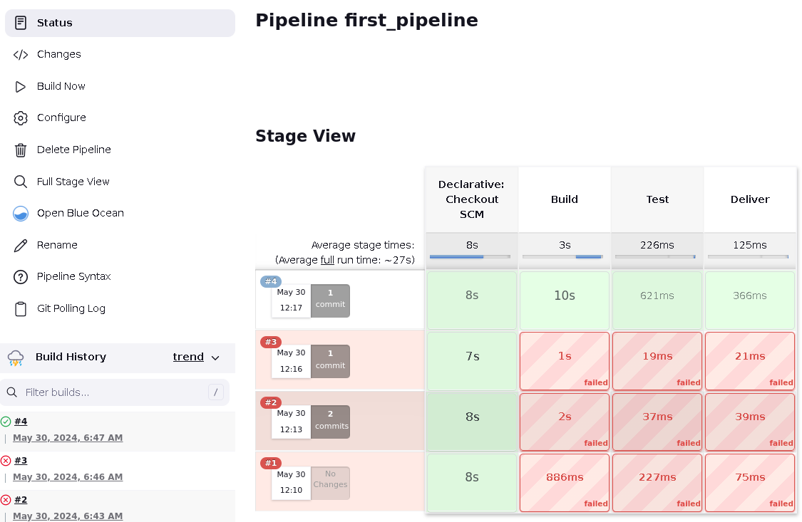
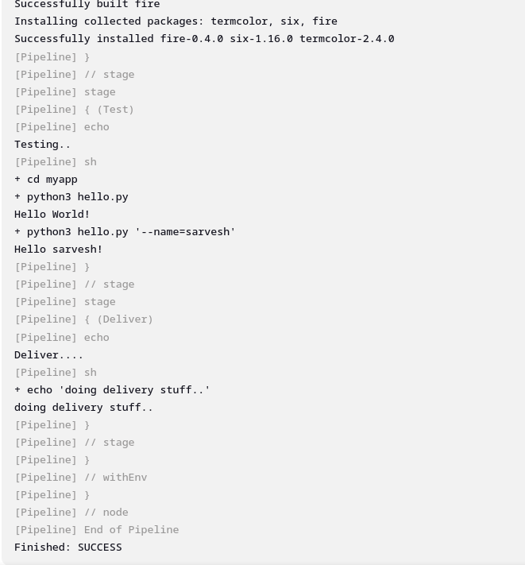

create pipeline, use pipeline script, declarative pipeline syntax is used. has 4 stages: “Build”, “Test”, and “Deploy”. self explanatory in [Jenkinsfile](https://github.com/Saru2003/jenkins_sample/blob/main/Jenkinsfile) (where the python prog receives arg and none, and prisnt output accordingly).

